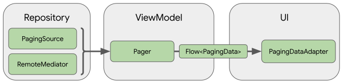

## Paging
- An Android application consuming [TMDB](https://developers.themoviedb.org/3/) to display a grid of movies image as I learn paging library. 

## Table of Contents
- [Prerequisite](#prerequisite)
- [Paging](#paging)
- [TechStack](#techstack)
- [ScreenShots](#screenshots)
- [CI/CD](#cicd)

## Prerequisite
- Android Studio
- [TMDB KEY](https://developers.themoviedb.org/3/)
- Kotlin

## Paging
- The library components operate in three layers :-
- Repository layer
- ViewModel layer
- UI layer
- 
* Repository Layer - Paging library component in the repository layer is PagingSource. Each PagingSource object defines a source of data
  and how to retrieve data from that source. Another paging library component is the RemoteMediator. Its object handles paging from a layered datasource eg network and local database cache.
* ViewModel Layer  - Pager component provides public API for constructing instances of PagingData. Component that connects the ViewModel layer to the UI is PagingData
* UI Layer - The primary paging library component is PagingAdapter, RecyclerView.

## TechStack
- [Paging](https://developer.android.com/topic/libraries/architecture/paging/v3-overview) - Library that helps load and display pages of
    data from a larger dataset from local storage or over network.
- [Koin](https://insert-koin.io/) - Dependency injection library for kotlin and android.
- [Jetpack Components](https://developer.android.com/jetpack)
    - [Jetpack Compose](https://developer.android.com/jetpack/compose) - Modern toolkit for building native UI.
    - [Android KTX](https://developer.android.com/kotlin/ktx.html) - Provide concise, idiomatic Kotlin to Jetpack and Android platform APIs.
    - [AndroidX](https://developer.android.com/jetpack/androidx) - Major improvement to the original Android [Support Library](https://developer.android.com/topic/libraries/support-library/index), which is no longer maintained.
        -   [Lifecycle](https://developer.android.com/topic/libraries/architecture/lifecycle) - Perform actions in response to a change in the lifecycle status of another component, such as activities and fragments.
        -   [ViewModel](https://developer.android.com/topic/libraries/architecture/viewmodel) - Designed to store and manage UI-related data in a lifecycle conscious way. The ViewModel class allows data to survive configuration changes such as screen rotations.
    - [Navigation Component](https://developer.android.com/guide/navigation/navigation-getting-started) - Component that allows easier implementation of navigation from simple button clicks to more complex patterns.
- [Retrofit](https://square.github.io/retrofit/) - Type-safe http client
  and supports coroutines out of the box.
- [GSON](https://github.com/square/gson) - JSON Parser,used to parse
  requests on the data layer for Entities and understands Kotlin non-nullable
  and default parameters.
- [CoilImage](https://coil-kt.github.io/coil/) - Image Loading Library
- [OkHttp-Logging-Interceptor](https://github.com/square/okhttp/blob/master/okhttp-logging-interceptor) - Logs HTTP request and response data.
- [Coroutines](https://github.com/Kotlin/kotlinx.coroutines) - Library Support for coroutines.
- [kotlinx.coroutines](https://github.com/Kotlin/kotlinx.coroutines) - Library Support for coroutines,provides runBlocking coroutine builder used in tests.

## Screenshots

## CI/CD
- [Github Actions](https://docs.github.com/en/actions) - The project uses Github actions for Continuous Integration and Continuous Delivery eg automated builds and firebase app distribution

